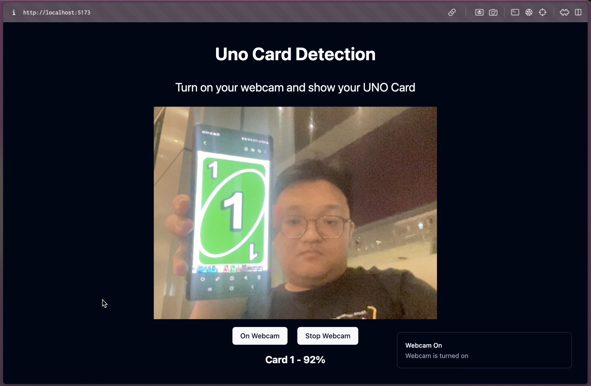

# UNO Card Detection Website using Svelte and FastAPI



## Note: If you are doing this for AIROST workshop

switch the branch from `main` to `workshop` branch

## Tech Stack Used

### Frontend

`Svelte` 

`Shadcn-svelte`

### Backend

`FastAPI`

`YOLOv8`

## How to run this program

first, start your backend

cd to your `backend`

```
python -m venv venv

source venv/bin/activate

pip install -r requirements.txt

venv/bin/uvicorn main:app --reload
```

Then start your frontend

cd to your `frontend` folder in a separate window

```
npm install

npm run dev
```

Open your `http://localhost:5173` port to see the result

## UNO Card Dataset Description

```python
{
    "0":0,
    "1":1,
    "2":2,
    "3":3,
    "4":4,
    "5":5,
    "6":6,
    "7":7,
    "8":8,
    "9":9,
    "+4":0,
    "+2":11,
    "reverse":12,
    "skip":13,
    "wild":14
}
```